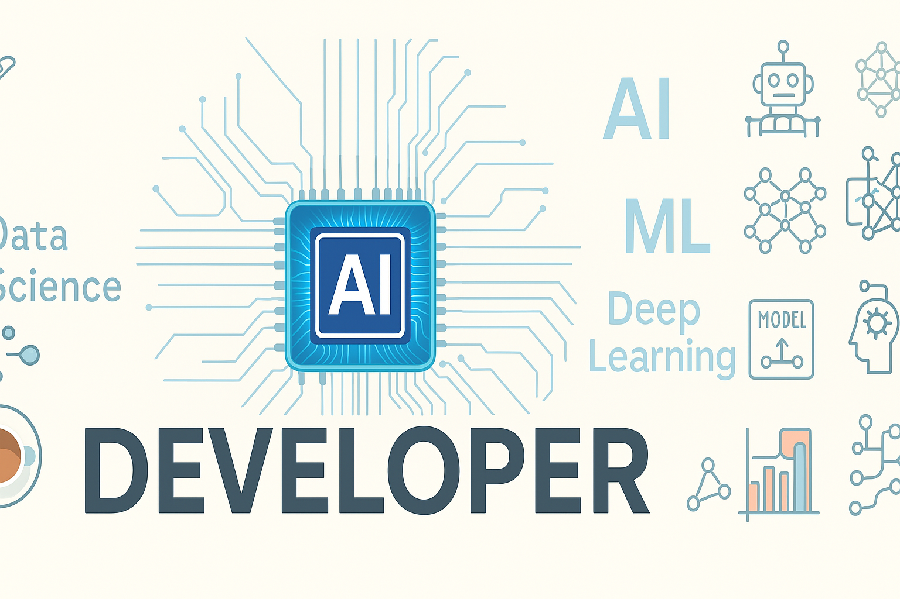

<!-- GitHub Profile README -->

<!--
-->
<!--    -->
<!-- 
 -->

<h1 align="center">Hi 👋, I'm Ayush Dhanker</h1>
<h3 align="center">AI/ML Enthusiast | Developer | Lifelong Learner</h3>

---

### 🧠 About Me

- 👨‍💻 Currently working on **AI and Machine Learning projects**
- ⚽ Former college football player – team spirit, discipline, and balance
- 📈 Passionate about solving real-world problems using tech
- Interests : Football, Fitness, Nutrition, Food, Self-improvement.

---

### 🚀 Tech Stack

- **Programming Languages:** Python, JavaScript 
- **ML & Data Science:** Scikit-learn, Pandas, NumPy, Matplotlib, TensorFlow (beginner), EDA, Feature Engineering 
- **Web Development:** React, Redux, JavaScript, HTML, CSS, jQuery
- **Tools & Platforms:** Git, GitHub, Jupyter Notebook, VS Code
- **Databases:** SQL (beginner), MongoDB (basic exposure)

---

### 📊 GitHub Stats

  
  

---

### 📫 Connect with Me

- [LinkedIn](https://www.linkedin.com/in/ayush-dhanker/)
- [Portfolio](https://my-portfolio-or2douenn-ayushdhankers-projects.vercel.app/)
- [Email](mailto:ayush.dhanker@gmail.com)

---

⭐️ *Thanks for visiting my profile! Feel free to check out my repositories and connect.*

